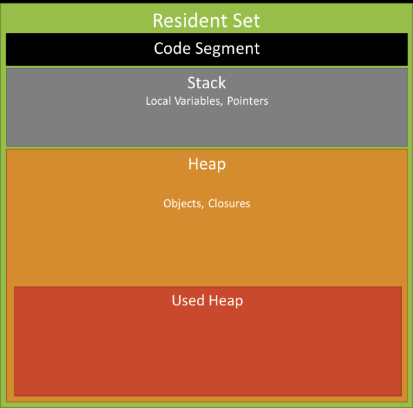

## 4.12 GC 垃圾回收

Memory leaks happen when expected short lived objects are attached to long lived ones。

```javascrip
const requests = new Map();
app.get('/',(req,res)=>{
	requests.set(req.id,req);
	res.status(200).send('hello world');
})
// top level map lives forever, requests are expected to short lived
```

## nodejs 垃圾回收

原理： 分辨已分配了的内存，对死去的内存重新分配，若其指向根对象，则始终保持活跃状态




## 堆 heap

V8将heap分为 **新生代** 和 **老生代**

### 新生代

**Scavenge**算法

1. 将 新生代的空间分成两个 semi-space, 活跃状态的称为 from-space 和 闲置状态的称为 to-space.
2. from-space 快满的时候触发 scavenge
3. 检查 from-sapce 中的对象，若对象存活，检查是否能晋升老生代，满足则晋升，不满足移动到 to-space
4. 如果对象不存活，则释放其使用空间
5. 完成上述工作，反转 from-sapce 和 to-space的角色

#### 晋升条件

1. 对象是否经历过 Scavenge 回收。如果已经经历过一次 Scavenge，则将对象晋升到老生代，否则复制到 To 空间。
2. To 空间的使用率是否超过限制（25%）。如果超过 25%的限制，则直接分配至老生代。设置 25% 的原因是，如果反转 semiplace 之后，空间占用比过高，会影响后续内存分配。

## 写屏障

为了解决： 新生区中对象被 老生区对象的指针 指着为了避免便利整个老生区

缓冲区有个列表- corssRefList, 记录

### 老生代

为什么不用 Scavenge 算法:

1. 老生代内存活对象比例高，时间长， 复制存活对象的操作会很多
2. 老生代的空间远大于新生代，会造成空间损失

**Mark-Sweep**算法

1. 分别标记和清除2个阶段，在标记阶段遍历堆中所有的对象，并标记存活的对象，
2. 在随后的清理阶段，只清除标记之外的对象。

原理:

1. 在标记阶段，核心是**深度优先**. 状态共有三色
   1. 白: 未被 GC 发现
   2. 灰: 已经被 GC 发现, 但仍未处理完毕
   3. 黑: 不仅已被 GC 发现，且所有接邻对象已都处理完毕

**Mark-Compact**算法

1. 为了解决 Mark-Sweep 算法的内存碎片问题， 将已标记的活的对象往一边移动，移动外后，内存空间是紧凑的，清除边界外的内存

**增量标记**:

1. 每次 GC 在 5-10 毫秒内处理一小部分内存空间，接着切换到应用程序线程，依次反复，直到垃圾收集完成。
2. 写屏障，记录老->新指针,和黑->白指针
   原理: 深度优先，和白黑灰机制来分类

**惰性清理**
每个页（注意，V8 的内存页是 1MB 的连续内存块，与虚拟内存页不同）都会包含一个用来标记的位图，位图中的每一位对应页中的一字。
缓慢清理每一页都数据，知道所有页都清理完毕，再增量标记