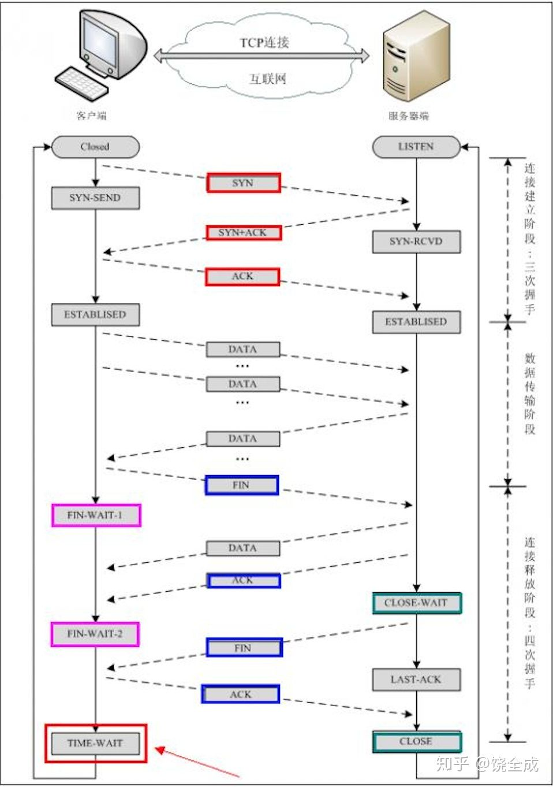
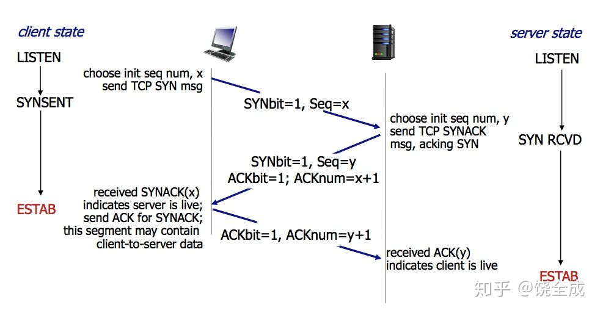
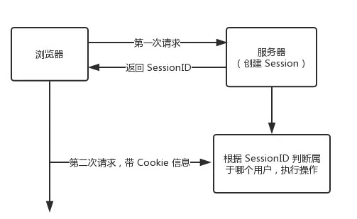

## HTTP/HTTPS

| HTTP 1.0 | HTTP 1.1          | HTTP 2.0                                               |
| -------- | ----------------- | ------------------------------------------------------ |
| 无状态   | 长链接 Keep-Alive | 头部压缩                                               |
| 明文传输 | **对头堵塞**      | 二进制格式                                             |
|          | **单向请求**      | 数据流                                                 |
|          | **Header过大**    | 多路复用：一个连接中并发多个请求或回应，而不用按照顺序 |
|          |                   | 服务器推送                                             |

| HTTP         | HTTPS           |
| ------------ | --------------- |
| 80           | 443             |
| TCP 三次握手 | TPC 3次+SSL4次  |
|              | 需要 CA证书     |
| 明文传输     | SSL/TLS安全加密 |

## 三次握手/四次握手

1. ACK —— 确认，使得确认号有效 
2. RST —— 重置连接（经常看到的reset by peer）就是此字段搞的鬼。
3.  SYN —— 用于初如化一个连接的序列号。
4.  FIN —— 该报文段的发送方已经结束向对方发送数据。

| 三次握手的意义 1. 确认双方都有接收发送信息的能力 2. 利用数据包的选项来传输特殊的信息  3. 交换初始序列号ISN(Initial Sequence Number) | 四次握手 1. 三次握手是ack+syn放在一个报文里面发送的 2. client的fin仅代表client不再发送数据 3. server的ack => client的fin. server的fin还需要上层应用决定 |
| ------------------------------------------------------------ | ------------------------------------------------------------ |
| 1. client的发送和server的接收能力 正常                       |                                                              |
| 2. client的接收发送和server的接收发送 正常                   |                                                              |
| 3. client开始发包, ack使 确认号有效                          |                                                              |
| 每次ack都为对方发送的syn上+1                                 | 每次ack都为对方发送的syn上+1                                 |

## OSI

应用/表示/会话 => 传输/网络/数据链路/物理

HTTP在应用层 

TCP,UDP在传输层

## Redis 持久化 persistence

1. rdb
2. aof
3. no
4. rdb+aof

|      | rdb                                                        | aof                            |
| ---- | ---------------------------------------------------------- | ------------------------------ |
| 原理 | 在额定时间内，新增/修改了多少条数据                        | 根据query / 时间，记录执行语句 |
| 优势 | 恢复速度快 生成对应不同时间点的多个备份文件 适合冷备 | 数据恢复全面 生成执行日志   |
| 缺点 | 数据丢失风险                                               | 体积大 恢复速度慢           |

## HTTPS加密

## TCP和UDP的区别

| tcp               | upd                                    |
| ----------------- | -------------------------------------- |
| 三次握手/四次握手 | 面向无连接                             |
| 仅支持单播传输    | 有单播，多播，广播的功能               |
| 面向字节流        | UDP是面向报文的                        |
| 可靠传输          | 不可靠性                               |
| TCP提供全双工通信 | 头部开销小，传输数据报文时是很高效的。 |

## 数据库中的四种事务隔离级别

1. `Read Uncommitted（未提交读）`会出现不可重复读、幻读问题
2. `Read Committed（提交读）` 会出现脏读、不可重复读、幻读
3. `Repeatable Read（重复读）`会出幻读
4. `Serializable（串行化）`保证所有的情况不会发生
5. `Deafult`=>Repeatable Read

三种特殊错误

- `脏读`dirty read 
  transaction A upsert a document, transaction B read it, if A failed and revert, b got fucked up by an unexsited doc

  特指,transaction A做到一半还未commit导致的错误

- `不可重复读` unrepeatable read
  transaction A read docs twice while transaction B changed the docs and committed.

  the two reading results are different

- `幻读` phantom problem
  幻读和不可重复读都是读取了另一条已经提交的事务（这点就脏读不同），所不同的是不可重复读查询的都是**同一个数据项**，而幻读针对的是**一批数据整体**（比如数据的个数）。

## commonJS和ES6的引入方式

|      | commonJs                                                     | es6                                      |
| ---- | ------------------------------------------------------------ | ---------------------------------------- |
| 导出 | module.exports /exports                                      |                                          |
| 引入 | const fs = require("fs")                                     |                                          |
|      | 代码运行时同步阻塞性地加载模块 动态                          | 静态                                     |
|      | 缓存可以解决重复查找和重复执行的问题,有就使用，没有就找然后写入缓存 | export的变量被改动了，会影响import的结果 |

## Session & cookie

|          | cookie     | session    |
| -------- | ---------- | ---------- |
| 大小限制 | 在4kb      | 理论无上限 |
| 位置     | client     | server     |
|          | 有安全隐患 | 相对安全   |
| 数据类型 | ascii only | any        |

## JWT

