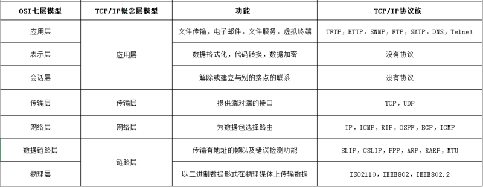

## OSI

应用/表示/会话 => 传输/网络/数据链路/物理

HTTP在应用层 

TCP,UDP在传输层

上三层 叫upper layer data

transport => segment

network => packet

data link=>frame

physical => bits

## Redis 持久化 persistence

1. rdb
2. aof
3. no
4. rdb+aof

|      | rdb                                                        | aof                            |
| ---- | ---------------------------------------------------------- | ------------------------------ |
| 原理 | 在额定时间内，新增/修改了多少条数据                        | 根据query / 时间，记录执行语句 |
| 优势 | 恢复速度快 生成对应不同时间点的多个备份文件 适合冷备 | 数据恢复全面 生成执行日志   |
| 缺点 | 数据丢失风险                                               | 体积大 恢复速度慢           |

## HTTPS加密

## 数据库中的四种事务隔离级别

1. `Read Uncommitted（未提交读）`会出现不可重复读、幻读问题
2. `Read Committed（提交读）` 会出现脏读、不可重复读、幻读
3. `Repeatable Read（重复读）`会出幻读
4. `Serializable（串行化）`保证所有的情况不会发生
5. `Deafult`=>Repeatable Read

三种特殊错误

- `脏读`dirty read 
  transaction A upsert a document, transaction B read it, if A failed and revert, b got fucked up by an unexsited doc

  特指,transaction A做到一半还未commit导致的错误

- `不可重复读` unrepeatable read
  transaction A read docs twice while transaction B changed the docs and committed.

  the two reading results are different

- `幻读` phantom problem
  幻读和不可重复读都是读取了另一条已经提交的事务（这点就脏读不同），所不同的是不可重复读查询的都是**同一个数据项**，而幻读针对的是**一批数据整体**（比如数据的个数）。

## Session & cookie

|          | cookie     | session    |
| -------- | ---------- | ---------- |
| 大小限制 | 在4kb      | 理论无上限 |
| 位置     | client     | server     |
|          | 有安全隐患 | 相对安全   |
| 数据类型 | ascii only | any        |

## JWT

